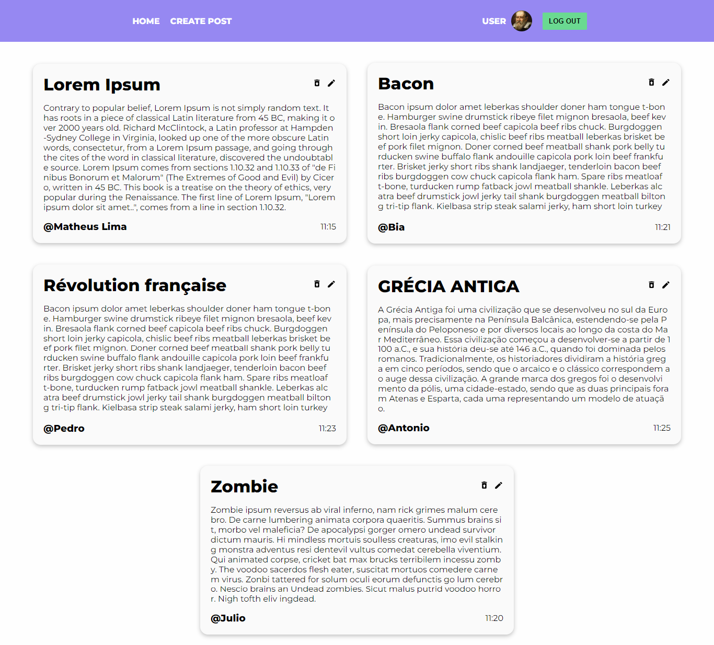

<h1 align="center">
   🔗 Blog
</h1>

 <a href="#descrição">🧾 Descrição</a> • 
 <a href="#tecnologias">🚀 Tecnologias</a> • 
 <a href="#settings">⚙ settings</a> •
 <a href="#license">📝 License</a> • 
 <a href="#autor">Autor</a>

<h2>🧾Descrição</h2>

<blockquote >
  Esta é uma aplicação ReactJS que usa o firebase como Banco de Dados, para simula um Blog, onde você pode inserir, editar ou deletar os posts. Além de poder, fazer o login usando a conta do (Google). Este projeto foi desenvolvido através de uma <a href="https://www.youtube.com/watch?v=zL0dKETbCNE" target="_blank">aula</a> sobre firebase, procurei adicionar mais fetures a página me estendendo naquilo que é proposto no video.
</blockquote>

Acesse o projeto clicando <a href="https://blog-react-lemon.vercel.app/" target="_blank"> aqui </a> 

<h2>🚀Tecnologias</h2/>

As seguintes ferramentas foram usadas na construção do projeto:

- [Firebase](https://firebase.google.com/)
- [ReactJs](https://pt-br.reactjs.org/)
- [Scss](https://sass-lang.com/)
- [Vite](https://vitejs.dev/guide/#scaffolding-your-first-vite-project)
- [React-Icons](https://react-icons.github.io/react-icons/)

<h2>⚙Settings</h2>

Segue os comandos para baixar e executar o projeto na sua máquina:

- <code>git clone</code> + <code>URL do Projeto</code>: clonar este repositório.
- <code>cd blog-react</code>: acessa a pasta do projeto no terminal.
- <code>npm i</code>: para baixar as dependências do projeto.
- <code>npm run dev</code>:
  Executa o projeto em modo/ambiente de desenvolvimento.

- Abra http://localhost:3000 para ver o projeto rodando no Navegador.

<h2>📝License</h2>

Esse projeto está sob a licença MIT. Veja o arquivo <a href="https://github.com/the-matheuslima/blog-react/blob/main/LICENSE">LICENSE</a> para mais detalhes.

### Autor

---

<a href="https://github.com/the-matheuslima/">
 
  
 <b>Matheus Lima</b></a>

Feito com ❤️ por Matheus Lima 👋🏽 Entre em contato!

